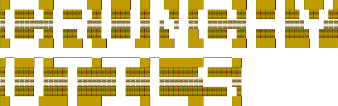

<h1>CrunchyUtils 🛠️⚙️</h1>

Simple program with various utilities. 

## 📥 [[Download here]](https://github.com/knuspii/crunchyutils/releases) <- Click here to download CrunchyUtils!

## 🔑 Key features:

- 💻 **Cross-Platform**: Works on both **Windows** and **Linux**
- ⚡ **Lightweight**: Single binary, no dependencies (just download and run it)
- 🎨 **TUI (Text-UI)**: Simple, minimalist interface, no confusing menus
